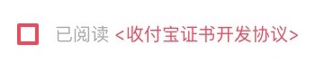

# CheckBox

## Instructions
>CheckBox base on Quartz

## Show


## Integration

### First

>If you want to use , you will only need to drag two core classes into your project and include the header file
```objectivec
#import "CheckBoxLable.h"
```

### Second

>To achieve the following code
```objectivec
@interface ViewController ()<CheckBoxLableDelegate>
CheckBoxLable * checkBox = [[CheckBoxLable alloc] initWithFrame:CGRectMake(20, 64, CGRectGetWidth(self.view.frame) - 40, 20) Protocol:@"<收付宝证书开发协议>" NormalTextColor:[UIColor colorWithRed:0.66 green:0.66 blue:0.66 alpha:1.00] ProtocolTextColor:[UIColor colorWithRed:0.93 green:0.29 blue:0.36 alpha:1.00]];
checkBox.delegate = self;
[self.view addSubview:checkBox];
#pragma MARK CheckBoxLableDelegate
- (void)isAgreeProtocol:(BOOL)isAgree
{
    NSString * str;
    if (isAgree) {
        str = @"已经勾选协议";
    }else{
        str = @"还未勾选协议";
    }
    NSLog(@"%@",str);
}
- (void)tapProtocol
{
    NSLog(@"查看协议");
}
```

### Third

>You are success!!! So easy........
